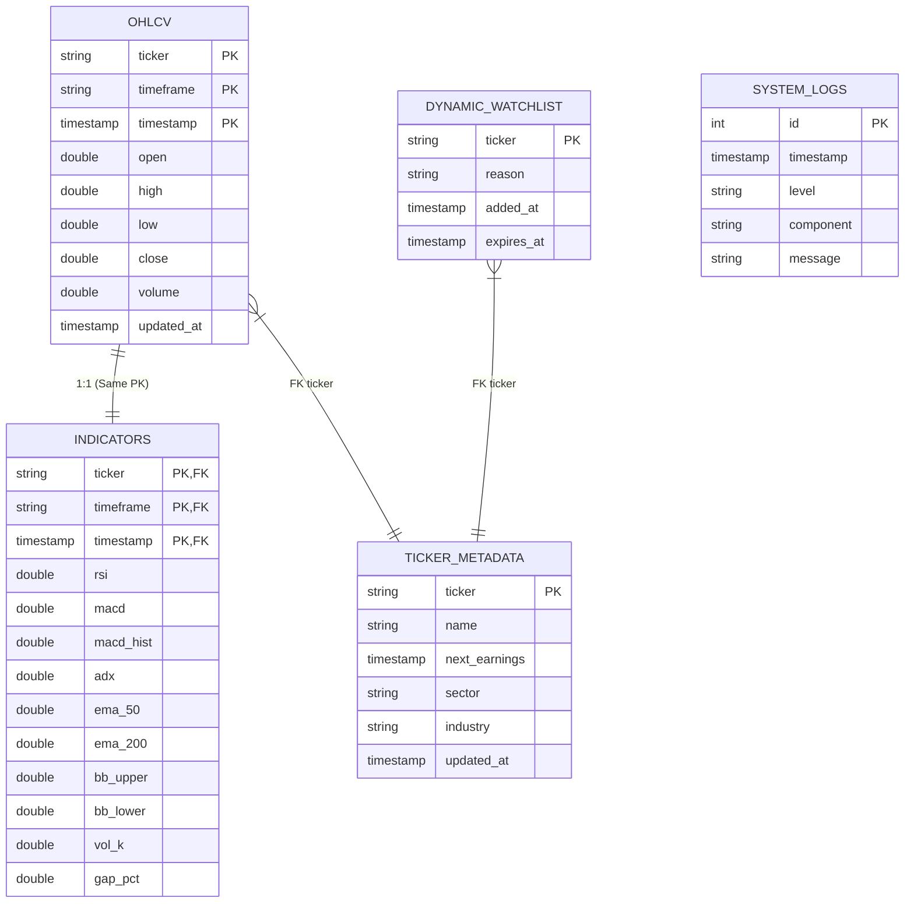

# MarketDashboard V2 - Database Schema
**Engine:** DuckDB  
**File:** `data/markets.duckdb`

## 🗺️ Diagrama Conceptual

## 📝 Descripción de Tablas

### 1. `ohlcv` (Time-Series Core)
Almacena los precios históricos y recientes.
- **Partitioning:** Lógico por `ticker` + `timeframe`.
- **Constraint:** Clave primaria compuesta `(ticker, timeframe, timestamp)` evita duplicados.

### 2. `indicators` (Analytics)
Almacena los cálculos técnicos derivados de OHLCV.
- **Diseño:** Tabla separada (Join 1:1) para permitir borrar/recalcular indicadores sin tener que volver a descargar precios (que es lo lento/costoso).
- **Sync:** Se actualiza incrementalmente vía `analyzer.py`.

### 3. `ticker_metadata` (Reference)
Información estática o de cambio lento.
- **Uso:** Enriquecer reportes con Nombres reales (`AAPL` -> "Apple Inc.") y fechas de Earnings.

### 4. `dynamic_watchlist` (The Bridge)
**Mecanismo de "The Funnel".**
- **Función:** Conecta el **Broad Scan** (Nivel 1) con el **Detailed Scan** (Nivel 2).
- **Flujo:**
    1. `broad_scan.py` detecta oportunidad diaria -> `INSERT`.
    2. `detailed_scan.py` lee activos vigentes (`expires_at > now()`) -> Monitorea intradía.
    3. Expiración automática (3 días default) limpia el ruido.

### 5. `system_logs` (Audit)
Log interno de DuckDB (opcional, duplicado de logs de texto por ahora).
